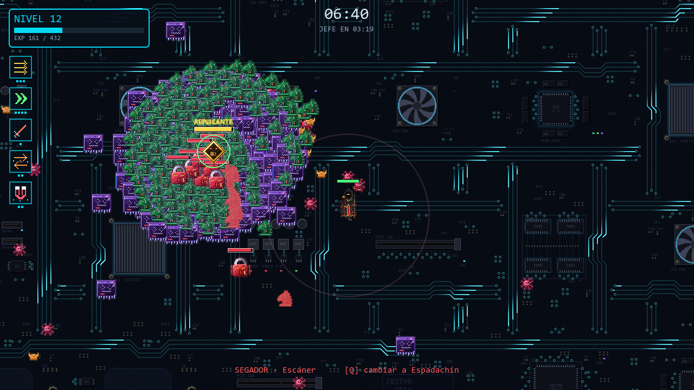
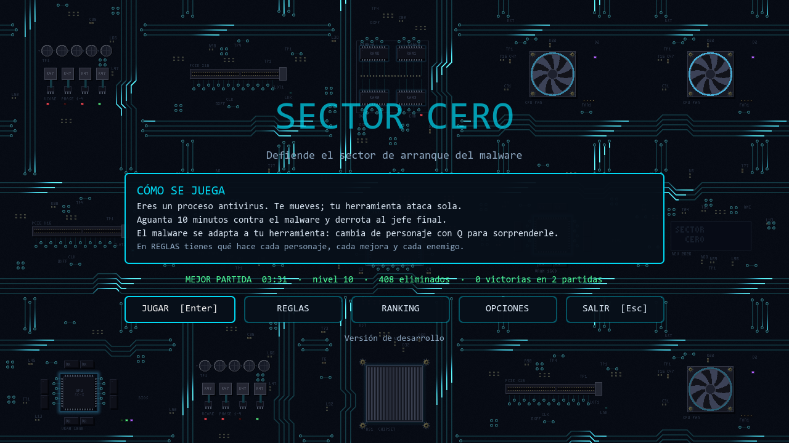
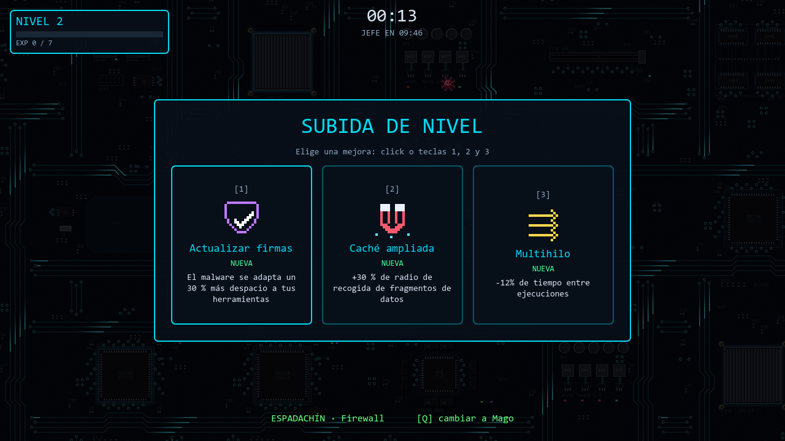
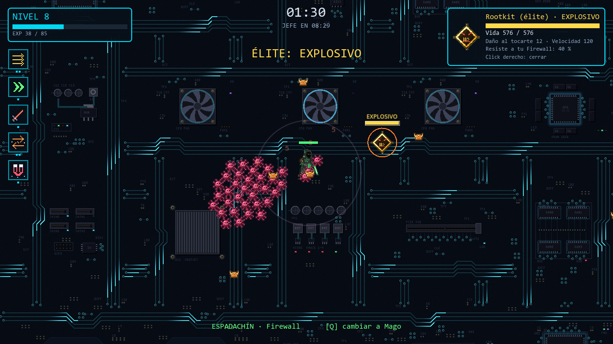
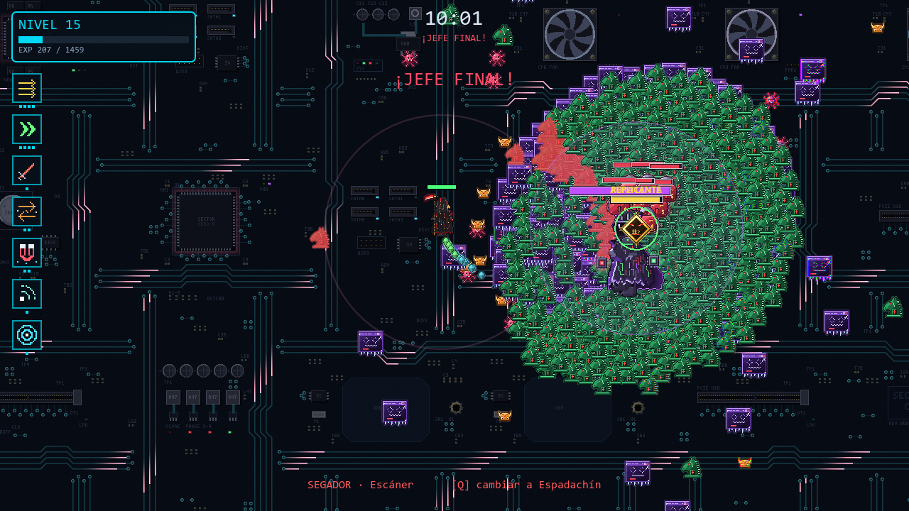
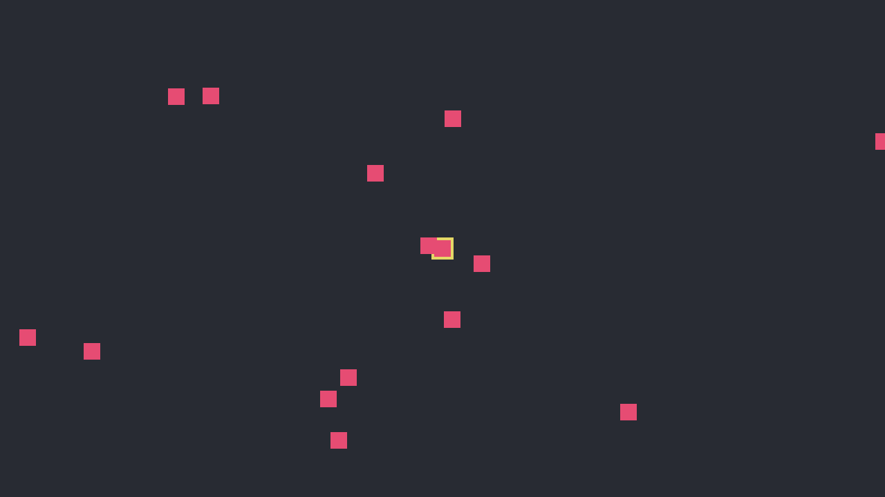

# Sector Cero

**Eres un antivirus. Tu ordenador está infectado. Aguanta diez minutos.**

  
    
  
   
  Escanea el QR con la cámara del móvil para jugar sin instalar nada.

Sector Cero es un videojuego en 2D hecho con Godot por Adam y Alan para la
asignatura "Demostra el teu talent". Es un *survivors-like*, como Vampire
Survivors: solo te mueves, tu herramienta ataca sola y cada vez llega más
malware. Lo que lo hace distinto: **el malware aprende**. Se vuelve resistente
a la herramienta que más daño le hace, así que tienes que cambiar de personaje
para sorprenderle.

## Jugar

**En el móvil o sin descargar nada:** abre
[adro158.github.io/sector-cero](https://adro158.github.io/sector-cero/) (o
escanea el QR de arriba). En el móvil sale un joystick a la izquierda y los
botones de cambiar de personaje y de pausa a la derecha.

**En el ordenador, la versión completa:**

1. Descarga la última versión de
   [Releases](https://github.com/adro158/sector-cero/releases) (el `.zip` de
   Windows o de Linux).
2. Descomprímelo.
3. Abre `SectorCero.exe` (en Linux, `SectorCero.x86_64`).

No hay que instalar nada. Cuando publicamos una versión nueva, el propio juego
la encuentra en unos minutos, aunque esté abierto, y avisa con un mensaje: con
**ACTUALIZAR** se descarga y se reinicia; con **AHORA NO** se sigue jugando y
el botón queda en el menú para más tarde.

| Acción | Teclado | Mando |
|---|---|---|
| Moverse | WASD o flechas | Stick izquierdo |
| Personaje siguiente / anterior | E o Tab / Q | Y / — |
| Ver el equipo | C | — |
| Pausa | Esc o P | Start |
| Elegir mejora | 1, 2, 3 o click | Cruceta y A |
| Ver la ficha de un enemigo | Click (click derecho la cierra) | — |
| Panel técnico | F3 | — |

## Cómo se juega

Aguanta 10 minutos contra oleadas de malware y derrota al jefe final. Los
enemigos sueltan fragmentos de datos; recógelos para subir de nivel y elegir
mejoras. Cada 20 segundos el malware se hace más resistente a la herramienta
que más le ha dañado: cuando veas tus números de daño en rojo, cambia de
personaje.

- **Tres personajes**, cada uno con su vida: el Espadachín (Firewall, golpea
  alrededor), el Mago (Ping, salta de un enemigo a otro) y el Segador (Escáner,
  un pulso amplio y lento). Si cae el que llevas, eliges quién sigue.
- **Cinco tipos de malware**, entre ellos el troyano, que avisa en rojo y
  embiste, y el ransomware, lento y durísimo.
- **Élites** cada minuto con habilidades al azar; si los matas, dejan un
  corazón que cura y un cofre con una ruleta de mejoras.
- **Evoluciones**: repite tres veces una mejora y tu herramienta evoluciona.
- **Ficha del enemigo**: haz click en cualquiera para ver su vida y su daño.
- **Ranking** con las diez mejores partidas.

El manual completo está en el [manual de usuario](documentacio/manual_usuario.md).

| | |
|---|---|
|  |  |
|  |  |

## Cómo lo hicimos

Empezamos el 18 de septiembre con un repositorio vacío. El primer juego fue un
cuadrado amarillo perseguido por cuadrados rosas; dos semanas después hay tres
personajes, cinco enemigos, élites, un jefe, música propia y un ranking.

| Día | Lo que pasó |
|---|---|
| 18/09 | Repositorio, arquitectura y reparto del trabajo |
| 22/09 | Del 3D al 2D y de vampiros a un ordenador infectado; la primera horda |
| 24/09 | La arena de neón de Alan, los números de daño y el Ping |
| 29/09 | El malware que se adapta (nuestro elemento diferencial) y el simulador de partidas |
| 30/09 | Jefe final, sprites, toda la interfaz y el cambio de personaje |
| 01/10 | Mapa infinito, audio, élites, evoluciones, efectos y actualizaciones desde el juego |
| 02/10 | Arte nuevo, troyano y ransomware, y todo lo que cambiamos tras jugarlo |

*Así era el juego el 22 de septiembre.*

La historia completa, con capturas reales de cada versión, está en
**[Historia del proyecto](documentacio/historia_del_proyecto.md)**.

## Documentación

- **[Historia del proyecto](documentacio/historia_del_proyecto.md)** — cómo
  evolucionó todo desde cero, con capturas. Empieza por aquí.
- [Documentación técnica](documentacio/documentacion_tecnica.md) — cómo está
  hecho por dentro.
- [Manual de usuario](documentacio/manual_usuario.md)
- [Créditos](documentacio/creditos.md) — de dónde sale cada gráfico y sonido.
- [Bitácora](documentacio/bitacora.md) — el diario de cada sesión, con todas
  las decisiones y pruebas.
- [Presentación](documentacio/presentacion.md) — guion de la defensa.
- [Flujo de trabajo](documentacio/flujo_de_trabajo.md) — Git, cómo ejecutar
  desde el código y cómo publicar una versión.

## Quiénes somos

- **Adam** — dirigió el proyecto: decidió qué hacer y cómo, pidió cada
  cambio, lo probó y lo revisó.
- **Alan** — hizo la primera arena con su fondo de neón, el primer HUD y el
  primer panel de mejoras, y probó el juego para decidir los últimos cambios.

**Uso de inteligencia artificial.** Las ideas y las decisiones son nuestras.
El código lo escribió sobre todo Claude (Anthropic) a partir de lo que le
pedíamos, y lo revisamos para poder explicarlo; la documentación también la
redactó Claude a partir de la bitácora de cada sesión. Los gráficos los hizo la IA
(Claude y Gemini) a partir de nuestras ideas, y el audio lo genera un script.
Está explicado en la [historia](documentacio/historia_del_proyecto.md#cómo-hemos-usado-la-inteligencia-artificial)
y en los [créditos](documentacio/creditos.md).

## Tecnologías

Godot 4.7.2 con GDScript y el renderizador Compatibility (OpenGL), shaders
propios, Git y GitHub (con una GitHub Action que publica cada versión) y Claude
como asistente de programación. Funciona en Windows y Linux.
