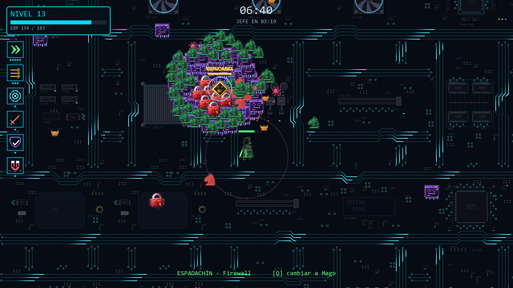
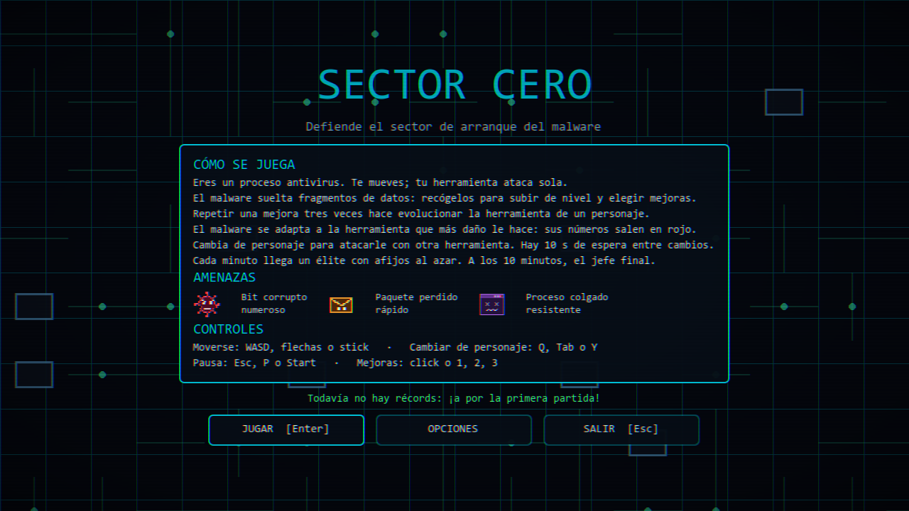
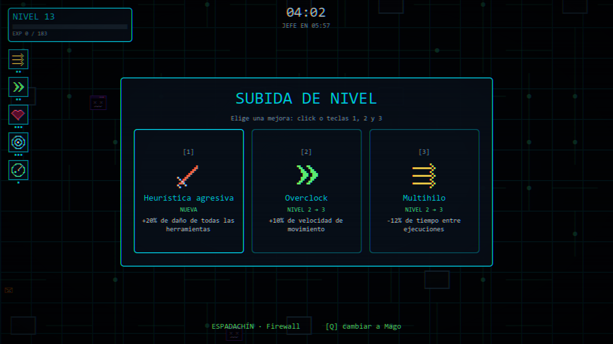
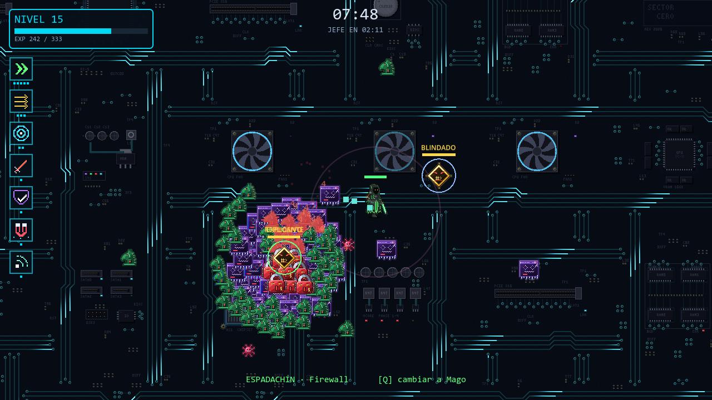
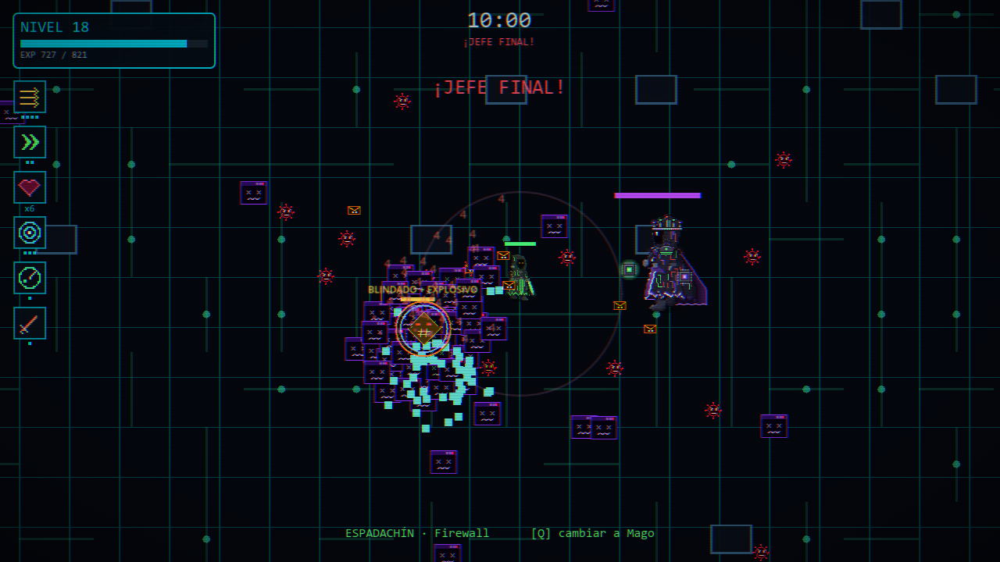

# Sector Cero

Proyecto académico para la asignatura "Demostra el teu talent": un
*survivors-like* en 2D hecho con Godot 4.7.2.

Eres un proceso antivirus dentro de un ordenador infectado y defiendes el
sector de arranque de oleadas de malware. Solo te mueves: tu herramienta ataca
sola. **El malware se adapta a la herramienta que más daño le hace**, así que
tienes que ir cambiando de personaje para atacarle con otra.



## Capturas

| Menú principal | Subida de nivel |
|---|---|
|  |  |
| **Élite con afijos** | **Jefe final** |
|  |  |

## Cómo ejecutarlo

### Con el ejecutable (sin instalar nada)

1. Descarga la última versión desde
   [Releases](https://github.com/adro158/sector-cero/releases).
2. Descomprime el `.zip`.
3. Abre `SectorCero.exe` (Windows) o `SectorCero.x86_64` (Linux).

No hace falta volver a descargarlo para tener la última versión: al abrirse, el
menú comprueba si hay una nueva y, si la hay, aparece el botón **ACTUALIZAR**.
Descarga solo el contenido nuevo (alrededor de 1 MB) y reinicia el juego.

### Desde el código

1. Instala [Godot 4.7.2](https://godotengine.org/download) (versión estándar,
   no la de .NET).
2. Clona el repositorio:
   `git clone https://github.com/adro158/sector-cero`
3. En Godot, *Importar* y elige `projecte/project.godot`.
4. Pulsa F5.

### Publicar una versión

Las releases las crea una GitHub Action
(`.github/workflows/publicar_release.yml`) al subir una etiqueta:

```
git tag v0.3
git push origin v0.3
```

La Action pone la versión de la etiqueta en el juego, exporta Windows y Linux,
y publica la release con el juego completo (`.zip`), el contenido para el botón
ACTUALIZAR (`sector_cero_windows.pck` y `sector_cero_linux.pck`) y
`version.json`.

Si una versión cambia algo de `project.godot` (autoloads, controles, ventana) o
añade un `class_name` nuevo, hay que subir `EJECUTABLE_MINIMO` en
`projecte/globales/version.gd` a esa versión: eso no viaja en el `.pck` y el
juego pedirá descargar el ejecutable entero.

Para exportar a mano hacen falta las plantillas de exportación de Godot 4.7.2.
Desde la carpeta `projecte/`:

```
Godot --headless --path . --export-release "Windows Desktop" ../build/windows/SectorCero.exe
Godot --headless --path . --export-release "Linux" ../build/linux/SectorCero.x86_64
```

## Controles

| Acción | Teclado | Mando |
|---|---|---|
| Moverse | WASD o flechas | Stick izquierdo |
| Cambiar de personaje | Q o Tab | Y |
| Pausa | Esc o P | Start |
| Elegir mejora | 1, 2, 3 o click | Cruceta y A |
| Panel técnico | F3 | — |

Las instrucciones completas están en el
[manual de usuario](documentacio/manual_usuario.md).

## Qué tiene

- **Horda de cientos de enemigos** dibujada con `MultiMeshInstance2D` (una
  llamada de dibujado por tipo) y una rejilla espacial propia para las
  colisiones. Medido en una RTX 5070: 1200 enemigos a más de 700 FPS, con
  la física en 9 ms de los 16,7 ms que hay por fotograma a 60 FPS.
- **Resistencia adaptativa del malware** (el elemento diferencial): cada 20 s
  gana resistencia contra la herramienta que más daño le ha hecho.
- **Tres personajes** con su herramienta (Firewall, Ping y Escáner) y cambio en
  plena partida.
- **Ocho mejoras y tres evoluciones**: además de las de ataque y defensa, una
  que frena la adaptación del malware, otra que acorta la espera entre
  personajes y otra que amplía el radio de recogida.
- **Élites con afijos procedurales**: blindado, replicante, aura lenta y
  explosivo, combinados al azar.
- **Cinco tipos de horda**, entre ellos el troyano, que embiste tras un
  parpadeo rojo, y el ransomware, un tanque lento del que no puede haber más de
  ocho a la vez.
- **Jefe final** con embestida telegrafiada.
- **Mapa infinito** con un suelo de placa base animado: baldosas de pixel art
  que encajan sin costuras y un shader con pulsos de datos que se aceleran
  durante la partida y se vuelven rojos con el jefe.
- **Récords y opciones guardados** (volumen, pantalla completa y filtro CRT).
- **Actualización desde el propio juego**: busca la última release en GitHub
  y se descarga solo el contenido nuevo.
- **Audio propio** sintetizado por código: 17 efectos y 3 músicas.
- **Feedback**: números de daño, partículas, destellos, glitch de la horda por
  shader, sacudida de cámara, filtro CRT y fundidos entre pantallas.

## Tecnologías

- **Godot Engine 4.7.2**, GDScript, renderizador Compatibility (OpenGL).
- Plataformas: Windows y Linux.
- Shaders propios en el lenguaje de shaders de Godot.
- Git y GitHub para el control de versiones y las releases.
- Claude (Anthropic) como asistente de programación. Su uso está explicado en
  la documentación técnica.

## Autores

- **Adam** — jugabilidad, enemigos, élites y jefe, armas y evoluciones,
  progresión, interfaz y menús, persistencia, audio, arena, efectos,
  herramientas de testeo y documentación.
- **Alan** — primera versión de la arena con su shader de rejilla, primer HUD
  y panel de mejoras, y módulo RAM.

## Créditos

La música, los sonidos y parte de los iconos son propios, generados por código.
Los sprites de los personajes y del jefe se hicieron con IA (Gemini y Claude) a
partir de un ejemplo del profesor, y los de la horda y el élite, tres iconos y
las texturas del suelo, con Claude. No hay assets de terceros. El detalle está
en [créditos](documentacio/creditos.md).

## Documentación

- [Manual de usuario](documentacio/manual_usuario.md)
- [Documentación técnica](documentacio/documentacion_tecnica.md)
- [Créditos de los assets](documentacio/creditos.md)
- [Bitácora de desarrollo](documentacio/bitacora.md)

## Estructura del repositorio

- `projecte/` — proyecto de Godot 4.7.2
- `documentacio/` — memoria y documentación entregable

Los nombres `projecte/` y `documentacio/` están en catalán porque el enunciado
los exige literalmente así. Todo lo demás está en castellano.

### Dentro de `projecte/`

- `globales/` — autoloads: actualizador, bus de eventos, guardado, audio,
  transiciones y filtro CRT, y la versión del juego
- `escenas/` — escenas del juego: arena, jugabilidad, interfaz y menú
- `recursos/` — clases de Resource y los `.tres` de datos (armas, mejoras,
  enemigos, afijos, personajes y oleadas)
- `medios/` — audio y shaders
- `herramientas/` — scripts que no forman parte del juego: generan los sprites
  y el audio, simulan partidas para el balance y miden el rendimiento

## Flujo de trabajo

### Mensajes de commit

```
<tipo>(<ámbito>): <descripción en imperativo y minúscula>
```

Tipos: `feat` (funcionalidad nueva), `fix` (corrección de un error),
`refactor` (cambio interno sin cambiar el comportamiento), `chore`
(configuración, estructura), `docs` (documentación), `assets` (modelos,
texturas, sonido).

Los tipos se mantienen en inglés porque son etiquetas estándar reconocibles en
cualquier repositorio; la descripción va en castellano.

Ámbitos: `jugador`, `enemigos`, `armas`, `progresion`, `oleadas`, `interfaz`,
`audio`, `guardado`, `arena`, `efectos`, `godot`.

Ejemplos:

```
feat(jugador): añadir movimiento relativo a la cámara con aceleración
fix(enemigos): corregir la fuerza de separación con muchas unidades
chore(godot): registrar autoloads y mapa de input
assets(arena): añadir texturas de suelo y paredes
```

Un commit es una unidad de trabajo con sentido propio. Ni un commit por fichero,
ni un commit semanal con todo mezclado.

### Ramas

Hay un único repositorio con dos ramas fijas que no se borran nunca:

- `main` — donde trabaja Adam. Es la versión del juego que se entrega.
- `feature/alan-arena-hud` — donde trabaja Alan.

Como cada uno tiene sus propios ficheros, las dos ramas casi nunca chocan.

**Al empezar la clase**, cada uno se baja lo que subió el otro.

Adam:

```
git switch main
git pull
git merge origin/feature/alan-arena-hud
```

Alan:

```
git switch feature/alan-arena-hud
git pull
git merge origin/main
```

Adam comprueba que el juego arranca después de fusionar. Si lo de Alan rompe
algo, no se sube: se avisa para que lo arregle en su rama.

**Al terminar la clase**, cada uno commitea sus ficheros y sube su rama:

```
git status
git add <tus ficheros>
git commit -m "tipo(ámbito): descripción"
git push
```

Antes del commit, mirar `git status`: Godot reescribe a veces ficheros al abrir
el proyecto. Si sale modificado un fichero del otro que no has tocado, se
descarta con `git restore <fichero>`.

**Al cerrar cada fita**, Adam la marca en el historial con una etiqueta:

```
git tag fita-2
git push --tags
```

**Para ver en qué punto estáis**, este comando dibuja el historial de las dos
ramas:

```
git log --graph --oneline --all
```

### Las tres reglas que importan

1. **`main` siempre tiene que poder ejecutarse.** Es la versión que se entrega:
   si entra algo roto, el otro se lo baja y se queda bloqueado.
2. **Cada uno commitea solo sus ficheros.** `projecte/escenas/juego.tscn` y
   `projecte/project.godot` son de Adam: si Alan necesita cambiarlos, se lo pide.
3. **Sincronizar en cada clase.** Bajar lo del otro al empezar y subir lo propio
   al terminar. Cuanto más tiempo pasan las ramas sin juntarse, más duele
   hacerlo.

### Sobre la autoría

Los commits guardan quién los escribió, y eso no cambia aunque los suba o los
fusione el otro. En el historial siempre queda registrado qué hizo cada uno.

### Regla de oro con las escenas

Los ficheros `.tscn` se fusionan mal en Git. Nunca editamos la misma escena a la
vez. La arquitectura ya lo evita: cada uno tiene sus escenas y la comunicación
pasa por el `BusEventos` y por nombres de grupo, no por referencias directas
entre nodos.
