# Historia de Sector Cero: de un cuadrado amarillo a un juego entero

Este documento cuenta cómo hicimos Sector Cero desde cero: qué fuimos
construyendo cada día, qué decidimos y por qué, qué salió mal y cómo lo
arreglamos. Las capturas de las primeras etapas no son montajes: para cada
una, Claude recuperó del historial de Git el juego tal como estaba ese día, lo
ejecutó con un script que mueve al jugador y le hizo la foto.

Somos **Adam** y **Alan**. El detalle de cada sesión (con todas las decisiones
y pruebas) está en la [bitácora](bitacora.md); aquí va la versión para leer de
un tirón.

---

## Antes de empezar: la idea

El enunciado pedía una experiencia interactiva que convenciera a un grupo de
"inversores", y avisaba de que vale más un proyecto pequeño y bien acabado que
uno enorme a medias. Nos gustaban los *survivors-like* tipo Vampire Survivors:
solo te mueves, tus armas atacan solas y cada vez hay más enemigos. Es una
mecánica sencilla de entender y muy agradecida de pulir.

La primera idea era hacerlo en 3D y con vampiros. Duró una sesión.

---

## 18 de septiembre · Sesión 1 — El esqueleto

Creamos el repositorio de GitHub con la estructura que pide el enunciado
(`projecte/`, `documentacio/` y el `README.md`) y, antes de escribir nada de
juego, pensamos la arquitectura: qué escenas habría, qué scripts, y sobre todo
**cómo repartirnos el trabajo sin pisarnos**. Los ficheros de escena de Godot
se fusionan muy mal en Git, así que cada uno tendría sus propios ficheros y
los sistemas hablarían entre ellos a través de un "bus de eventos" (un nodo
que solo tiene señales), sin tocarse directamente.

El primer problema llegó enseguida: en el ordenador del instituto (una máquina
virtual) Godot no encontraba la tarjeta gráfica y dibujaba con el procesador.

## 22 de septiembre · Sesión 2 — De 3D a 2D, y de vampiros a un ordenador

Ese día tomamos las dos decisiones que más han marcado el proyecto:

- **Pasar de 3D a 2D.** El 3D multiplicaba el trabajo (modelos, luces,
  cámara) sin aportar nada a la mecánica. En 2D podíamos acabarlo.
- **Cambiar la temática.** Los vampiros eran lo de siempre. Ahora eres un
  **proceso antivirus dentro de un ordenador infectado** y el malware viene a
  por el sector de arranque. Así nació el nombre, *Sector Cero*. Además encajaba
  con una limitación técnica: los enemigos no podían tener animación (luego
  explicamos por qué), y en un ordenador que unos virus se muevan "a tirones"
  queda bien.

También arreglamos lo de la gráfica de la máquina virtual y fijamos el
renderizador *Compatibility*, que funciona en casi cualquier ordenador.

Y empezó el juego de verdad. Primero, un cuadrado amarillo que se movía:

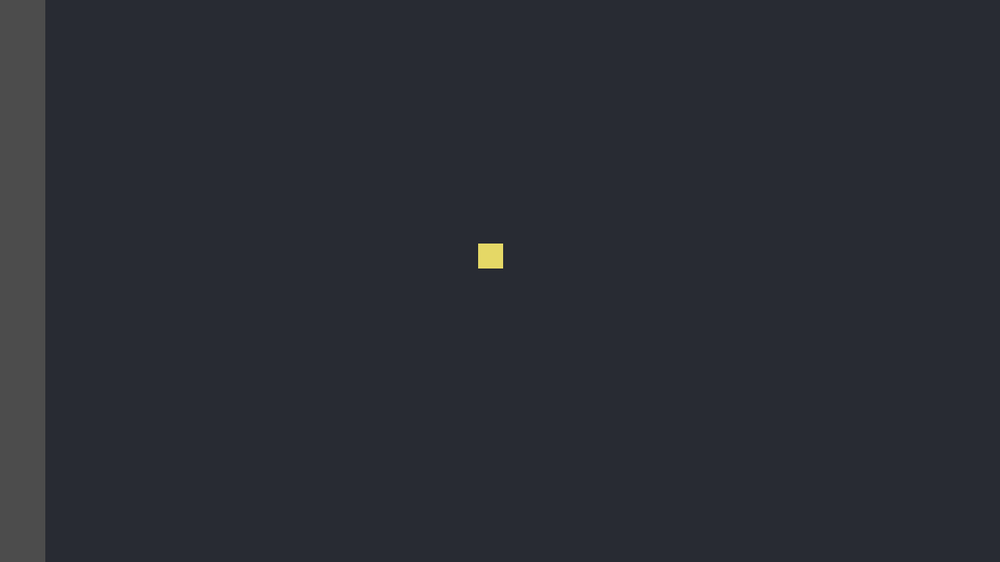
*22/09 — El jugador era un cuadrado amarillo con aceleración y frenado.*

Ese mismo día llegó la horda. La decisión técnica más importante del proyecto
fue esta: **un enemigo no es un nodo de Godot, es una posición dentro de una
lista**. Con un nodo por enemigo, cientos de enemigos serían cientos de cosas
que procesar y dibujar por separado. Así, cada tipo de enemigo es una lista de
posiciones y vidas, y un solo `MultiMeshInstance2D` los dibuja todos de una
vez. Para que no se amontonaran unos encima de otros hizo falta una **rejilla
espacial** (dividir el mapa en celdas y mirar solo las cercanas): con 500
enemigos, el cálculo pasó de 19 ms a 4 ms por fotograma.

*22/09 — La horda ya persigue, el arma ataca sola, los enemigos sueltan
experiencia y se sube de nivel. Todo son cuadrados de colores.*

Mientras, **Alan** hizo la primera arena: la escena con sus límites, el punto
de aparición del jugador y un shader de rejilla de neón para el fondo.

## 24 de septiembre · Sesión 3 — La arena de Alan y el Ping

Juntamos la arena de Alan con la jugabilidad. Añadimos los **números de daño**
que saltan al golpear y una segunda forma de atacar: el **Ping**, un proyectil
que salta de un enemigo a otro. Alan hizo también el primer **HUD** (vida y
nivel) y el primer panel para elegir mejoras.

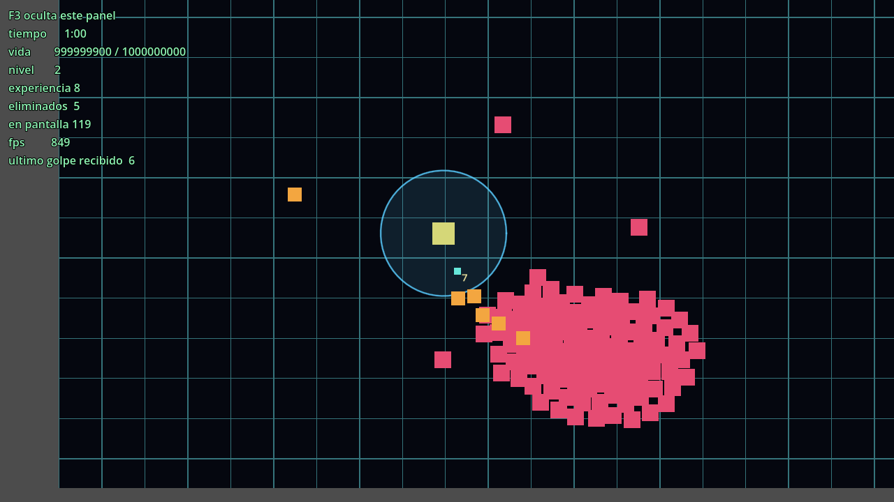
*24/09 — La rejilla de neón de Alan, el anillo del arma y, arriba a la
izquierda, el panel técnico que usábamos para probar.*

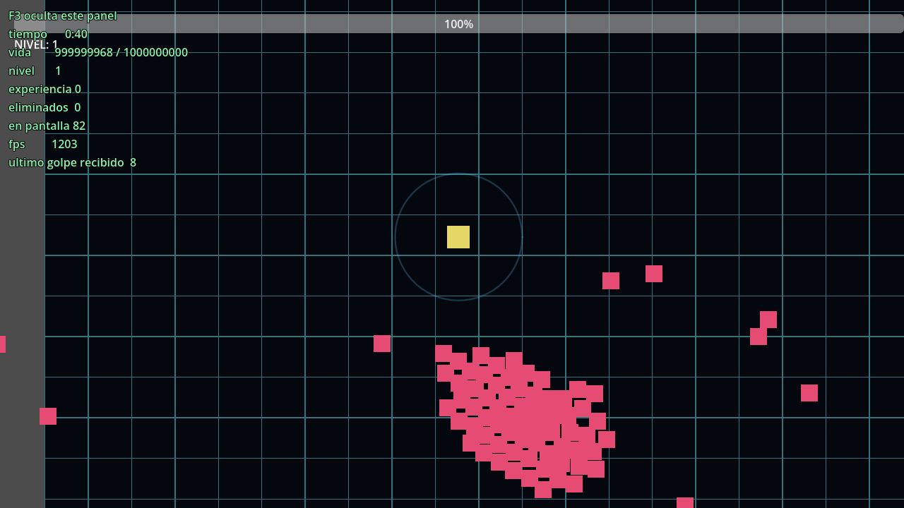
*29/09 — El HUD de Alan ya dentro del juego: la barra de vida arriba y el
nivel.*

Ese día perdimos la conversación con la IA (se reinstaló la aplicación) y nos
dimos cuenta de que el contexto no puede vivir solo en un chat. Desde entonces
todo queda escrito en el repositorio: la bitácora, el estado de los requisitos
y unas instrucciones (`CLAUDE.md` y `GEMINI.md`) que cualquier sesión nueva lee
al empezar. También cambiamos la forma de usar Git a algo más sencillo: dos
ramas fijas, `main` para Adam y otra para Alan.

## 29 de septiembre · Sesión 4 — Lo que hace distinto al juego

Esta fue la sesión del **elemento diferencial**. En los juegos del género lo
normal es encontrar el arma más fuerte y no soltarla. En Sector Cero **el
malware se adapta**: cada 20 segundos mira qué herramienta le ha hecho más daño
y se vuelve un 10 % más resistente a ella (hasta un 50 %), y pierde
resistencia contra las demás. Igual que el malware de verdad aprende a
esquivar los antivirus más usados. Se ve en los números de daño, que se van
volviendo rojos.

También llegaron:

- La **pausa** al subir de nivel, el menú de pausa y la **victoria** al
  sobrevivir 10 minutos.
- El jugador se pone rojo y la cámara tiembla al recibir daño.
- El primer **sprite animado** del personaje, en ocho direcciones.
- Un fondo provisional de placa base.
- El primer **ejecutable** que funciona sin abrir Godot.
- El **simulador de partidas**: un bot que juega partidas enteras solo, siempre
  con la misma "suerte", para poder comparar un cambio de equilibrio antes y
  después con datos.

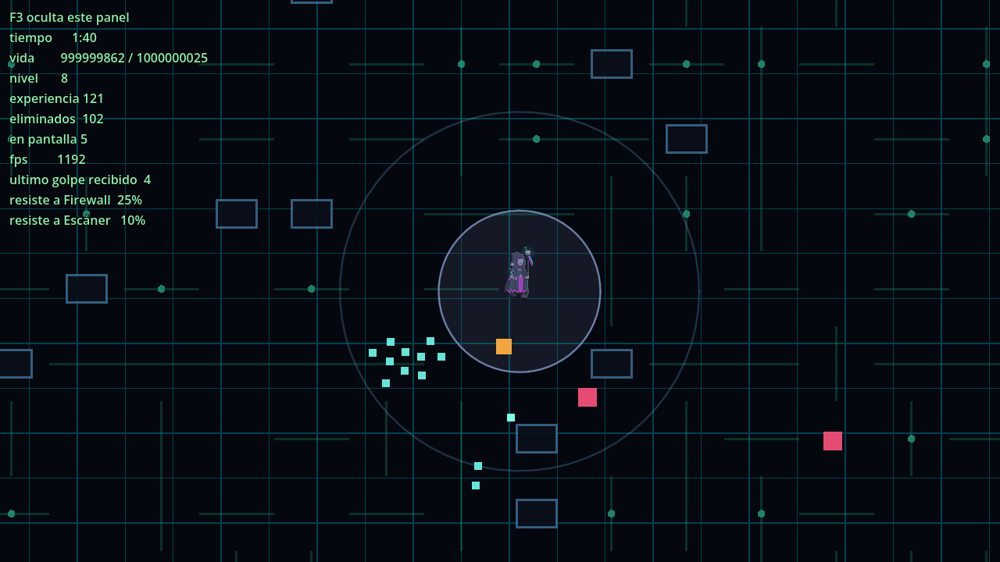
*29/09 — El primer personaje animado. En el panel técnico, abajo: el malware
ya resiste un 25 % al Firewall y un 10 % al Escáner.*

El simulador nos dio el primer susto: **el juego era imposible**, el bot moría
siempre antes del minuto. Probamos varias soluciones con datos y la que
funcionó fue añadir regeneración de vida.

También descubrimos un fallo raro del motor: en los shaders, un número como
`0.05` llegaba como `0.5`. Lo comprobamos con un shader mínimo que pinta
valores conocidos y desde entonces esos números se escriben como divisiones
(`1.0 / 20.0`).

## 30 de septiembre · Sesión 5 — Ya parece un juego

- **Jefe final** a los 10 minutos: deja de salir horda, el jefe persigue y
  cada pocos segundos se pone rojo y embiste. Derrotarlo es ganar.
- **Sprites** para los enemigos e **iconos** para las mejoras.
- **La interfaz completa**: menú de inicio, HUD con reloj, cuenta atrás del
  jefe y columna de mejoras, panel de subida de nivel, pausa y pantalla final.
- **Tres personajes**, cada uno con su herramienta (Firewall, Ping y Escáner),
  y cambio de personaje en plena partida. Esto convirtió la resistencia del
  malware en una decisión: cuando se adapta a tu herramienta, cambias.
- La primera **release** en GitHub (v0.1), para que Alan pudiera jugar sin
  abrir Godot.

Cambiamos el reparto: la interfaz estaba tan unida a la jugabilidad (pausas,
mejoras, fin de partida) que era más fácil que la llevara una sola persona.
Adam se quedó la interfaz, la arena y el arte, y Alan el audio.

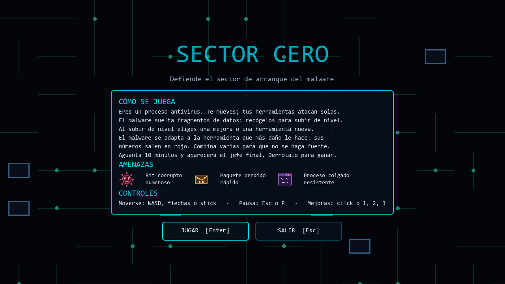
*30/09 — El primer menú: cómo se juega, las amenazas y los controles.*

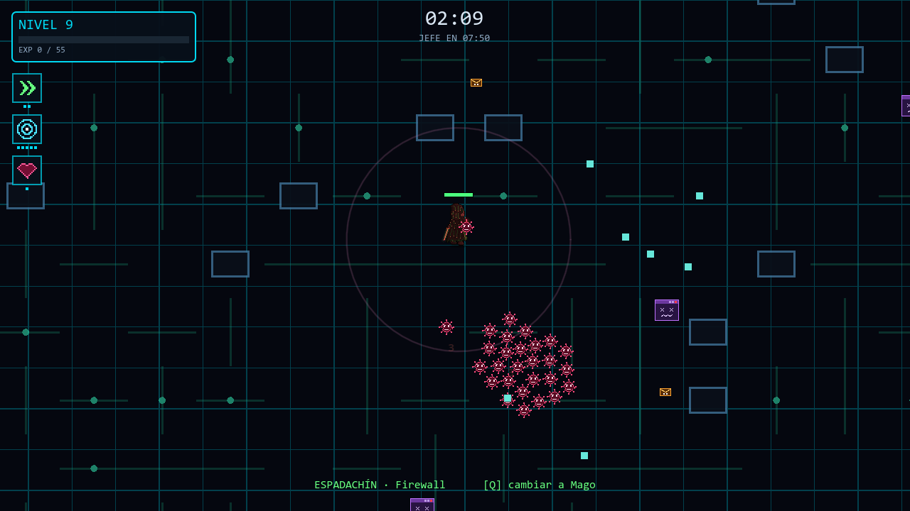
*30/09 — HUD completo: nivel, experiencia, reloj, cuenta atrás del jefe,
mejoras elegidas y el personaje activo abajo.*

## 1 de octubre · Sesión 6 — El gran salto

Fue la sesión más larga y se hizo desde casa, en un ordenador con una tarjeta
gráfica de verdad (una RTX 5070), donde por fin pudimos medir el rendimiento:
**1200 enemigos a más de 700 FPS**.

- **Mapa infinito**, como en Vampire Survivors: el suelo sigue a la cámara y
  ya no hay paredes.
- **Récords y opciones** guardados (volumen, pantalla completa, filtro).
- **Audio**: el audio pasó a Adam, porque estaba sin empezar y es un requisito
  mínimo. Todo el sonido (17 efectos y 3 músicas) lo genera un script que suma
  ondas, como los chips de sonido de las consolas antiguas: es propio y no hay
  licencias que acreditar.
- **Efectos**: partículas, destello blanco al golpear, un "glitch" que hace
  saltar a los enemigos como una imagen corrupta, y un filtro de monitor
  antiguo (CRT) sobre toda la pantalla.
- **Élites** cada minuto, con uno o dos **afijos** al azar (blindado,
  replicante, aura lenta, explosivo).
- **Evoluciones**: si eliges tres veces la misma mejora, tu herramienta
  evoluciona y el malware empieza sin resistencia contra ella.
- **Ventana de reglas** en el menú y **actualización desde el propio juego**:
  al abrirlo, mira en GitHub si hay una versión nueva y, con el botón
  ACTUALIZAR, se descarga solo lo que ha cambiado (1 MB en lugar de 110).

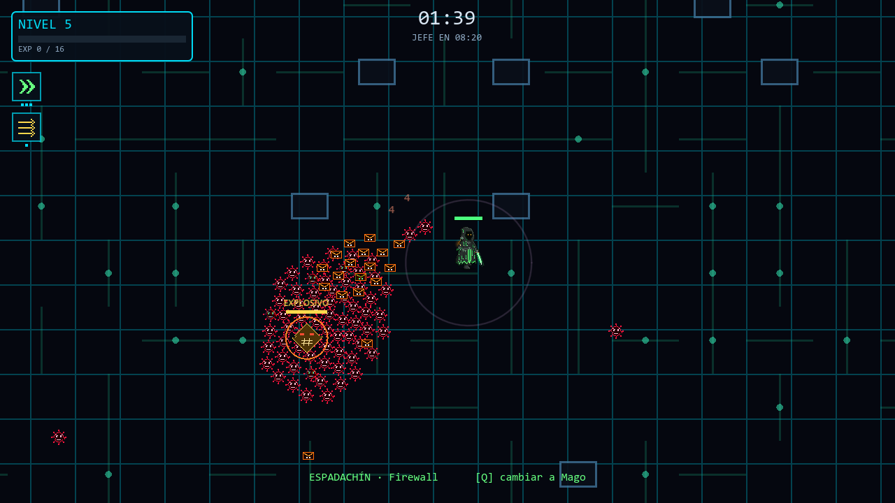
*01/10 — Mapa infinito, un élite "EXPLOSIVO" rodeado de horda y el filtro CRT.*

El mapa infinito rompió el equilibrio: sin paredes, el bot huía de todo, no
mataba y nunca encontraba al jefe. Tras seis rondas de ajustes con el
simulador lo dejamos en **4 victorias de cada 5**, que es lo que decidimos que
debía ganar un buen jugador. Una de las causas era curiosa: el afijo "aura
lenta" dejaba al jugador más lento que el enemigo más básico, que se le
pegaba hasta matarlo.

## 2 de octubre · Sesión 7 — Arte nuevo y dos enemigos más

Adam encargó a Claude, en una conversación aparte, arte nuevo: un **suelo de
placa base animado** (12 baldosas que encajan sin costuras, con pulsos de
datos que recorren las pistas, LEDs y ventiladores; los pulsos se aceleran
con la partida y se vuelven rojos con el jefe), los **enemigos redibujados**
y dos enemigos nuevos:

- El **troyano**, que se para, parpadea en rojo y embiste como el jefe.
- El **ransomware**, un tanque lento con mucha vida.

Y tres mejoras nuevas: **Actualizar firmas** (el malware se adapta más
despacio), **Cambio en caliente** (menos espera entre personajes) y **Caché
ampliada** (recoges la experiencia desde más lejos).

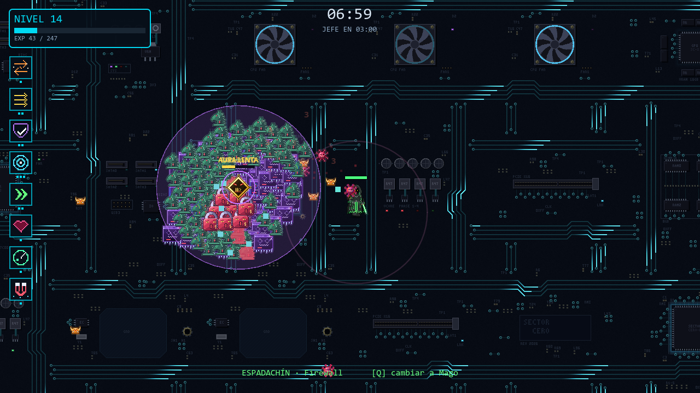
*02/10 — El suelo animado de placa base, los enemigos redibujados, el
ransomware (candado rojo) y los troyanos (caballos verdes).*

Dos cosas que aprendimos ese día:

- **Un error que llevaba ahí desde el principio.** Al probar el parpadeo rojo
  del troyano, salía marrón. Midiendo píxel a píxel descubrimos que el shader
  de la horda aplicaba la textura dos veces: todos los enemigos se veían más
  oscuros de lo que eran. Lo arreglamos y la horda pasó a verse con sus colores
  de verdad.
- **El simulador también tiene que parecerse a un jugador.** Con las mejoras
  nuevas el bot pasó de ganar 7 de 10 a 2 de 10, pero porque elegía mejoras al
  azar. Le enseñamos a elegir como lo haría una persona (evoluciones y mejoras
  de ataque) y el resultado fue 8 de 10.

El ransomware nos enseñó otra: salían unos 250 por partida, lentos, que se
acumulaban detrás del jugador. Ahora nunca hay más de 8 a la vez.

## 2 de octubre · Sesión 8 — Lo que pedimos después de jugarlo

Adam y Alan jugamos la versión publicada y apuntamos lo que no nos gustaba:

| Lo que vimos jugando | Lo que hicimos |
|---|---|
| El personaje amarillo (Segador) era mucho más fuerte que los otros dos | Su Escáner llega menos lejos y es más lento; el Firewall llega más lejos y el Ping salta una vez más |
| Las mejoras estaban rotas | La de daño y la de alcance dan menos, y las evoluciones son más flojas |
| Llegaba un momento en que los enemigos morían de un golpe | Ganan un 4 % de vida por cada nivel que subes |
| Se subía de nivel demasiado rápido | Cada nivel cuesta un 50 % más que el anterior |
| Faltaba presión | Salen el doble de enemigos |
| Los enemigos fuertes no recompensaban | Matar un élite cura la mitad de la vida y regala una mejora |
| No se veía bien la vida de los enemigos grandes | Barras de vida con borde en élites, jefe y ransomware |
| Queríamos ver los datos de un enemigo, como en el League of Legends | Al hacer click en un enemigo sale su ficha: vida, daño, velocidad y resistencia |
| La experiencia sin recoger se acumulaba en el mapa | Desaparece a los 30 segundos, parpadeando antes |
| Queríamos comparar partidas | Ranking de las 10 mejores partidas, con nombre |

Al juntarlo todo, el bot **no ganaba ninguna partida de 10**: a los 9 minutos
tenía más de mil enemigos encima. Probamos nueve variantes con el simulador y
lo que más pesaba era la vida extra por nivel; con un 4 % en lugar de un 8 % y
un poco más de daño en las herramientas, quedó en **6 de cada 10**, que es la
dificultad que buscábamos ahora: se puede morir, pero jugando bien se gana.

---

## Cómo es el juego hoy

Estas capturas son del juego actual. Las hizo Claude con un script que juega
una partida de demostración (el jugador es invulnerable para que dé tiempo a
enseñarlo todo) y va haciendo fotos de cada cosa.

| | |
|---|---|
|  | 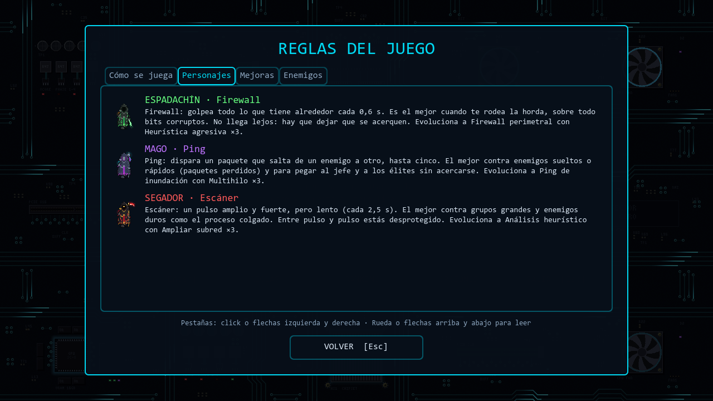 |
| **Menú principal**, con el récord y los botones de reglas, ranking y opciones | **Reglas**: qué hace cada personaje y cuándo conviene |
| 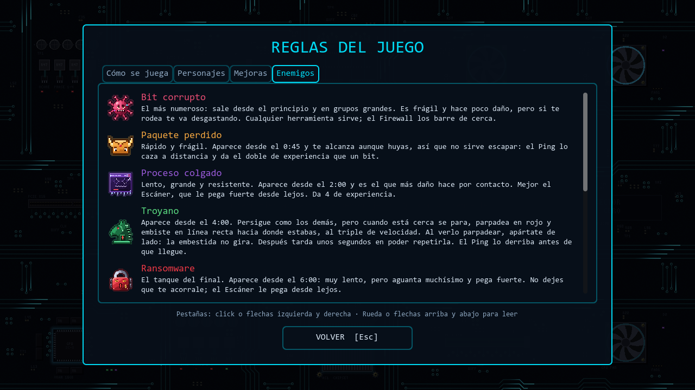 | 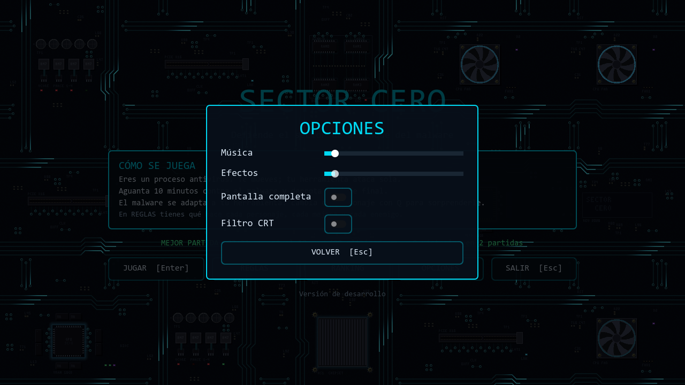 |
| **Reglas**: cada enemigo y cómo combatirlo | **Opciones**: volumen, pantalla completa y filtro CRT, que se guardan |
|  | 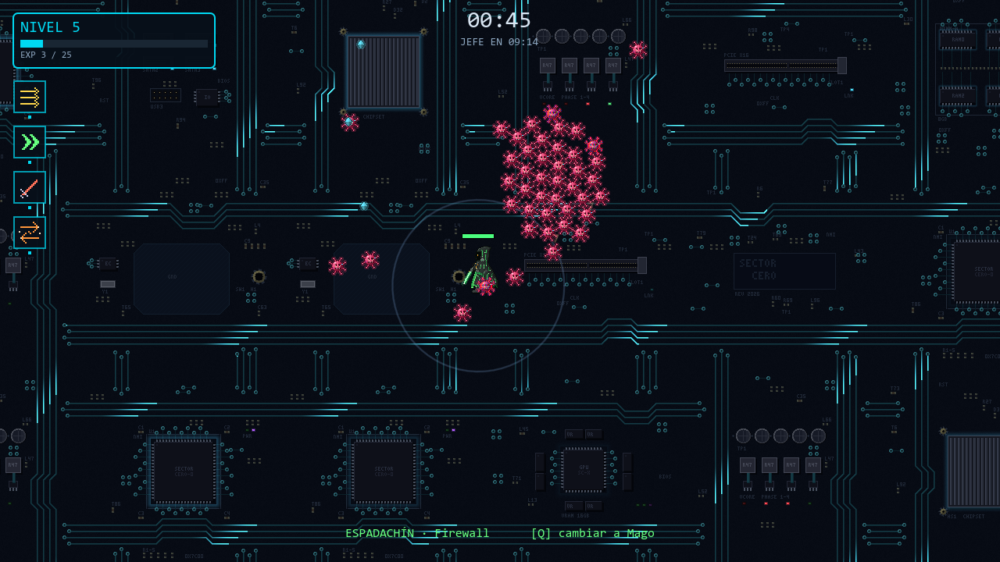 |
| **Subida de nivel**: el juego se pausa y eliges una de tres mejoras | **Partida**: la experiencia sale cian, verde o dorada según lo que vale |
|  | 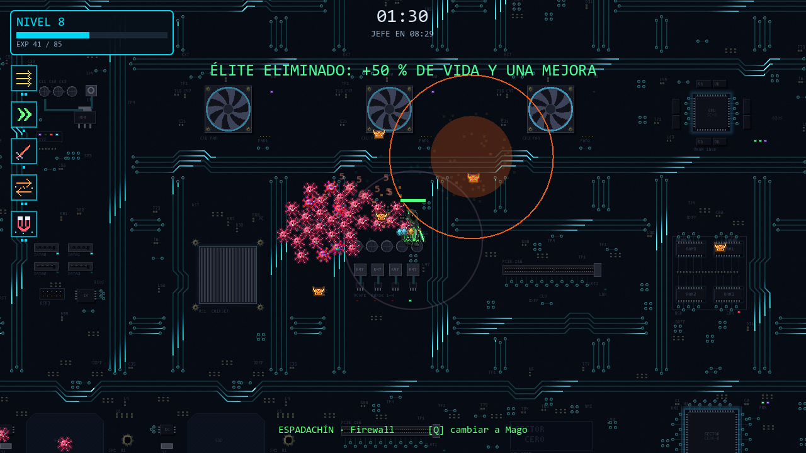 |
| **Un élite** con su afijo y, arriba a la derecha, **su ficha** al pinchar en él | **Al matarlo**: +50 % de vida y una mejora extra |
| 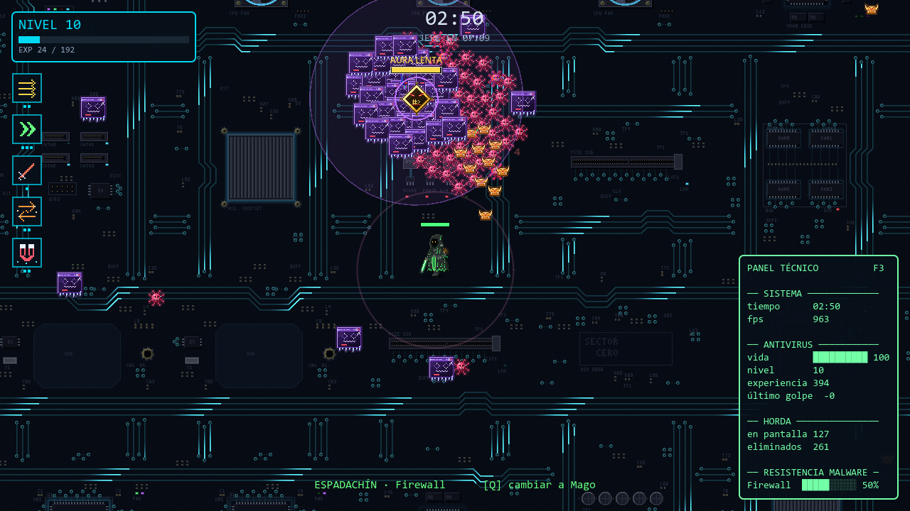 | 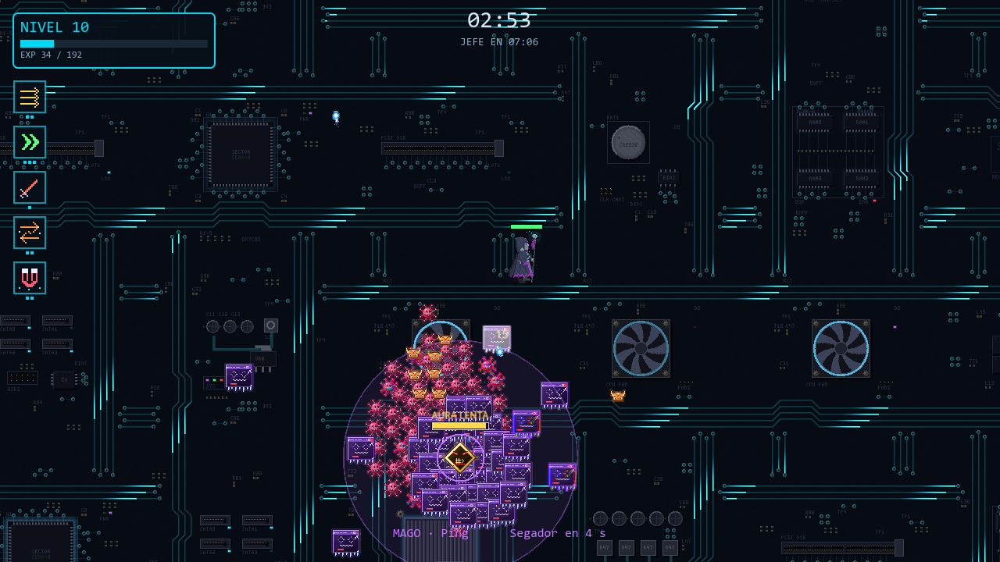 |
| **Panel técnico (F3)**: el malware ya resiste un 50 % al Firewall | **Cambio de personaje**: el Mago y su Ping |
|  |  |
| **Ransomware** con su barra de vida y troyanos | **El jefe final**, con la horda que lo rodea |
| 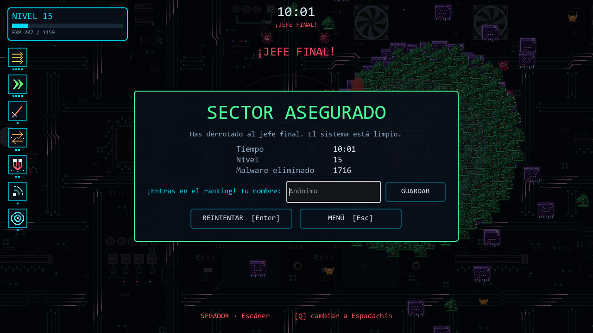 | 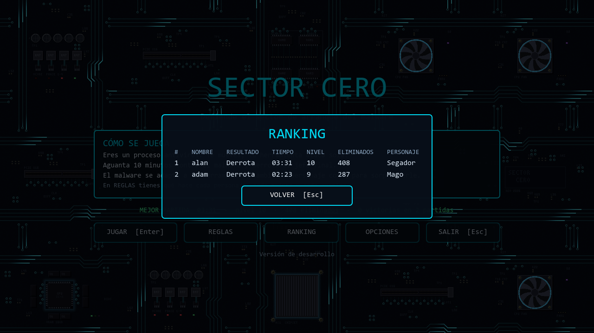 |
| **Victoria**: si la partida entra en el top 10, pide un nombre | **Ranking** con nuestras partidas de prueba |

---

## Cómo hemos trabajado

**Git.** El historial cuenta la evolución commit a commit (más de 90), con una
convención de mensajes del tipo `feat(enemigos): añadir el jefe final`. Al
principio cada uno tenía su rama y sus ficheros para no pisarnos; cada versión
que jugamos está publicada como *release* con su número.

**Bitácora.** Al terminar cada sesión apuntábamos qué se había hecho, qué se
decidió y por qué, qué falló y cómo se probó. Es lo que ha permitido escribir
este documento, y lo que permite retomar el trabajo en cualquier ordenador.

**Probar con datos.** Nada se daba por bueno sin ejecutarlo: el juego se
arranca sin ventana tras cada cambio para ver si hay errores, hay pruebas que
provocan una situación y comprueban el resultado, capturas para lo visual, y
el simulador de partidas para el equilibrio.

**Horas.** Unas 15 horas de sesiones de trabajo de las 60 que sugería el
enunciado, del 18 de septiembre al 2 de octubre.

## Cómo hemos usado la inteligencia artificial

El enunciado permite usar IA siempre que entendamos y sepamos defender lo que
entregamos. Así la hemos usado:

- **Las ideas y las decisiones son nuestras.** La temática la elegimos de una
  lista de propuestas que nos hizo Claude; el reparto, el estilo, qué hacer en
  cada momento, qué mecánicas tener y cuánta dificultad, lo decidimos
  nosotros. Muchas veces
  Claude nos ponía varias opciones y elegíamos; algunas mejoras las propuso él
  (por ejemplo, cómo limitar el ransomware o cómo hacer que el bot juegue como
  una persona) y nos gustaron.
- **El código lo escribió sobre todo Claude** (Anthropic), con Claude Code, a
  partir de lo que le pedíamos y siguiendo unas normas que le pusimos:
  todo en castellano, scripts cortos, comentarios que expliquen el porqué y,
  ante la duda, la versión más fácil de explicar. La primera arena con su
  shader de rejilla, el primer HUD y el primer panel de mejoras los hizo Alan
  en su rama.
- **Las pruebas** las ejecutamos siempre: Claude escribía las pruebas y el
  simulador, y nosotros jugábamos y decíamos qué no funcionaba (la sesión 8
  sale entera de una partida de prueba nuestra).
- **Los gráficos los hizo la IA a partir de nuestras ideas.** Los personajes y
  el jefe: el profesor nos enseñó unos sprites hechos con Claude, Adam hizo con
  Gemini una ilustración con nuestra temática y Claude creó las hojas de
  sprites. Los enemigos, los iconos, el suelo, la experiencia y el proyectil
  del Ping los dibujó Claude. El audio lo genera un script.

Todo está detallado en [créditos](creditos.md) y, sesión a sesión, en la
[bitácora](bitacora.md).

## Lo que aprendimos

- **Recortar a tiempo.** Pasar a 2D el segundo día fue lo que hizo posible
  acabar.
- **Escribir las cosas.** Perder una conversación nos enseñó a que todo el
  contexto viva en el repositorio.
- **Medir antes de cambiar.** Muchas de nuestras intuiciones sobre el
  equilibrio eran falsas; el simulador nos lo enseñó varias veces.
- **Una prueba también hay que probarla.** Una de nuestras pruebas pasaba
  incluso con el código roto; desde entonces comprobamos que una prueba falla
  cuando debe fallar.
- **Jugar el juego.** La lista de la sesión 8 salió de jugar nosotros, y
  cambió el juego más que cualquier otra sesión.
